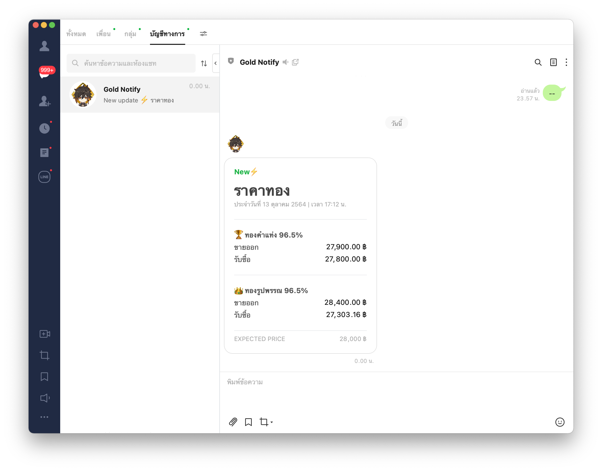

# Gold Notify

A simple rest api that helps you noti your plugin by providing useful data like gold price market.




## Getting Started

### Prerequisite
1. Make sure that you already have [Node.js](https://nodejs.org/en/) 12 or above

2. Clone repository

```bash
git clone https://github.com/mintmint95/gold-notify.git
```

### Installing
Install the package via npm

```bash
npm install
```
